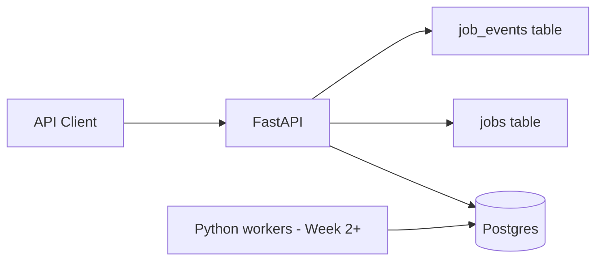

# ReliQueue

A durable distributed job queue and task scheduler built with **FastAPI**, **Postgres**, and **Python workers**.

ReliQueue stores jobs in Postgres, exposes a REST API for submission and inspection, and records an append-only event timeline for every job. Workers, retries, and a dashboard are coming in later weeks.

## What works today (Week 1)

- FastAPI service with health checks
- Docker Compose environment (API + Postgres)
- Durable job schema (`jobs`, `job_events`, `workers`)
- Job submission with idempotency keys
- Job list, detail, and event timeline APIs
- Postgres-backed pytest suite
- Worker runner skeleton with registration and polling

## Architecture (draft)



**Flow today**

1. Client submits a job via `POST /api/jobs`.
2. API writes a `pending` row to `jobs` and a `job_created` event to `job_events`.
3. Client polls list/detail/events endpoints to inspect job state.

**Coming in Week 2+**

- Python worker processes that claim jobs with `FOR UPDATE SKIP LOCKED`
- Retries, dead-letter queue, lease recovery, metrics, and dashboard

## Prerequisites

- [Docker](https://docs.docker.com/get-docker/) and Docker Compose
- Python 3.11+ (for local development and tests)

## Quick start

### 1. Clone and start services

```bash
git clone https://github.com/rmarathe-hub/ReliQueue.git
cd ReliQueue
docker compose up --build -d
```

### 2. Run database migrations

```bash
docker compose exec api alembic upgrade head
```

### 3. Verify the API

```bash
curl http://localhost:8000/health
```

Expected:

```json
{"status": "ok", "database": "ok"}
```

Open interactive docs: [http://localhost:8000/docs](http://localhost:8000/docs)

### 4. Create a job

```bash
curl -X POST http://localhost:8000/api/jobs \
  -H "Content-Type: application/json" \
  -d '{
    "job_type": "sleep",
    "payload": {"seconds": 3},
    "max_attempts": 3,
    "idempotency_key": "demo-1"
  }'
```

Save the `id` from the response, then:

```bash
# List jobs
curl 'http://localhost:8000/api/jobs?status=pending&limit=50'

# Job detail (replace JOB_ID)
curl http://localhost:8000/api/jobs/JOB_ID

# Event timeline
curl http://localhost:8000/api/jobs/JOB_ID/events
```

### Stop services

```bash
docker compose down
```

## Local development (without Docker API)

Useful if you want hot reload outside the container.

```bash
# Terminal 1 — Postgres only
docker compose up db

# Terminal 2 — API
cd backend
python -m venv .venv
source .venv/bin/activate          # Windows: .venv\Scripts\activate
pip install -r requirements.txt
cp ../.env.example ../.env
alembic upgrade head
uvicorn app.main:app --reload --host 0.0.0.0 --port 8000
```

## API reference

| Method | Path | Description |
|--------|------|-------------|
| `GET` | `/health` | API and database health |
| `POST` | `/api/jobs` | Submit a job |
| `GET` | `/api/jobs` | List jobs (`status`, `queue_name`, `job_type`, `limit`, `offset`) |
| `GET` | `/api/jobs/{job_id}` | Job detail |
| `GET` | `/api/jobs/{job_id}/events` | Job event timeline |

### Job submission body

```json
{
  "job_type": "sleep",
  "payload": {"seconds": 3},
  "max_attempts": 3,
  "idempotency_key": "demo-1",
  "queue_name": "default",
  "priority": 0
}
```

### Idempotency rules

| Case | Response |
|------|----------|
| New job | `201 Created` |
| Same `idempotency_key` + same payload | `200 OK` (returns existing job) |
| Same `idempotency_key` + different payload | `409 Conflict` |

### Job statuses

`pending` · `running` · `succeeded` · `dead_lettered` · `cancelled`

## Tests

Requires Postgres (for example `docker compose up db`).

```bash
cd backend
source .venv/bin/activate
pip install -r requirements.txt
pytest -v
```

Tests use a separate `reliqueue_test` database, create it if needed, run migrations, and truncate tables between tests.

## Workers

Start a worker process (requires Postgres running and migrations applied):

```bash
cd backend
source .venv/bin/activate
python -m app.worker.runner --worker-id worker-1
```

Optional flags:

```bash
python -m app.worker.runner --worker-id worker-1 --queue-name default --poll-interval 2
```

The worker registers in the `workers` table, claims pending jobs using Postgres `FOR UPDATE SKIP LOCKED`, runs the matching handler, and marks successful jobs `succeeded`. Failure handling is added on Day 15.

### Supported demo job types

| `job_type` | Behavior |
|------------|----------|
| `sleep` | Waits `payload.seconds` |
| `fail_once` | Fails on first attempt (`attempts == 1`), succeeds on retry |
| `fail_always` | Always raises an error |
| `random_fail` | Fails with `payload.probability` (default `0.5`) |
| `generate_report` | Simulates report generation for `payload.duration` seconds |

## Configuration

Copy `.env.example` to `.env` and adjust as needed.

| Variable | Description |
|----------|-------------|
| `DATABASE_URL` | Async Postgres URL for the API |
| `TEST_DATABASE_URL` | Postgres URL used by pytest |
| `DEBUG` | Enable FastAPI debug mode |
| `WORKER_LEASE_SECONDS` | Worker lease duration for claimed jobs |

## Project structure

```text
ReliQueue/
├── backend/
│   ├── app/
│   │   ├── api/routes/      # HTTP handlers (health, jobs)
│   │   ├── core/            # Settings
│   │   ├── db/              # Engine and session
│   │   ├── models/          # SQLAlchemy models
│   │   ├── schemas/         # Pydantic models
│   │   ├── services/        # Business logic
│   │   ├── worker/          # Worker runner CLI
│   │   └── main.py
│   ├── alembic/             # Migrations
│   ├── tests/               # Pytest suite
│   ├── Dockerfile
│   ├── pytest.ini
│   └── requirements.txt
├── docker-compose.yml
├── .env.example
└── README.md
```

## Roadmap

- [x] Week 1 — API foundation, schema, job lifecycle endpoints, tests
- [ ] Week 2 — Worker engine and safe concurrent claiming
- [ ] Week 3 — Retries, dead-letter queue, lease recovery
- [ ] Week 4 — Metrics, dashboard, demo scripts
- [ ] Week 5 — CI, integration tests, documentation
- [ ] Week 6 — Portfolio polish

## License

MIT
